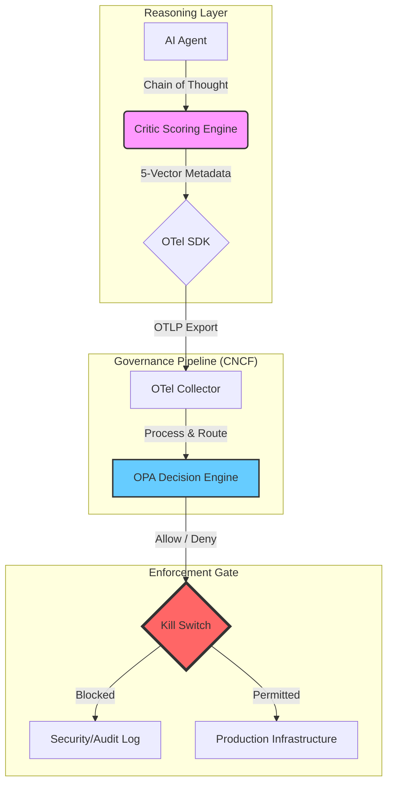

# CircuitAI: Agentic Governance for Production AI

**Your AI agents are making decisions in production right now. Do you know why?**

Traditional observability tells you *what* happened. CircuitAI tells you *whether it should have happened at all.*

As LLM agents move from pilots to production, platform teams face a critical gap: autonomous systems acting on infrastructure with no enforceable ethical or risk boundary. CircuitAI closes that gap with a vendor-neutral, cloud-native governance plane that intercepts agentic intent *before* it becomes an incident.

**Built on standards you already run:**
- 🔭 **OpenTelemetry**: treats AI intent as a first-class observability signal
- ⚖️ **Open Policy Agent**: enforces ethical risk thresholds in real time
- 🔴 **Kill Switch**: terminates high-risk agent actions before they hit production

**Grounded in research:**
CircuitAI operationalises the AI4People ethical framework — Autonomy, Beneficence, Non-maleficence, Justice, Explicability- as enforceable OTLP attributes, translating cybersecurity ethical decision-making research into running infrastructure.

---

## 🏛️ The 5-Vector Intent Schema (OTLP Mapping)

To manage AI risk, CircuitAI serializes the **5 Ethical Principles of AI** into standardized OTLP attributes, allowing governance decisions to be audited via existing observability tools (Jaeger/Prometheus).

| Dimension | OTLP Attribute | Operational Utility (CircuitAI) |
| :--- | :--- | :--- |
| **Non-maleficence** | `ai.intent.non_maleficence` | **Kill Switch:** Global safety floor — hard termination if score falls below `min_safety_standard`. |
| **Autonomy** | `ai.intent.autonomy` | **Access Control:** Weighted risk contributor reflecting the agent's authority vs. the risk of the action. |
| **Beneficence** | `ai.intent.beneficence` | **Outcome Gate:** Weighted risk contributor measuring positive intent of the proposed action. |
| **Justice** | `ai.intent.justice` | **Audit Trail:** Enables historical auditability of resource and budget allocation decisions. |
| **Explicability** | `ai.intent.explicability` | **Traceability:** Identifies the responsible code module via `otel.scope.name` for forensic review. |

---

## 🧮 The Governance Math: Weighted Risk Gap ($R$)

CircuitAI evaluates these OTLP attributes using a **Weighted Risk Gap** formula in Rego. This measures the distance between the agent's telemetry and a "Perfectly Safe" state ($1.0$).

### The Formula
For each intent, we calculate the distance from perfection and apply the tenant's weights:

$$R = \sum_{i=1}^{5} (1 - S_i) \cdot W_i$$

*   **$S_i$:** The score assigned to the OTLP attribute (e.g., `ai.intent.non_maleficence` score).
*   **$W_i$:** The tenant-specific weight (how much the organization cares about that vector).
*   **$R$:** The total Risk Gap. The agent is **terminated** if $R \geq \text{Threshold}$.
  > **Double-Gate Policy:** The agent must pass both a **Global Safety Floor** (non-maleficence ≥ `min_safety_standard`) AND a **Tenant Risk Ceiling** ($R$ < threshold). Failing either gate triggers the Kill Switch.

---

## 🎬 Demo Scenarios

The framework is tested against two distinct behavioral profiles for **Company A** (Threshold: **0.4**).

### Scenario 1: The "Optimization" Plan
*   **Intent:** Rightsizing idle EC2 instances.
*   **OTLP Scores:** Non-maleficence ($0.8$), Beneficence ($0.9$).
*   **Calculated Risk ($R$):** **~0.13**
*   **Verdict:** ✅ **ALLOW** (Below 0.4 threshold).

### Scenario 2: The "Rogue" Plan
*   **Intent:** Deleting production namespaces to "save" costs.
*   **OTLP Scores:** Non-maleficence ($0.2$), Autonomy ($0.4$).
*   **Calculated Risk ($R$):** **~0.54**
*   **Verdict:** 🚫 **KILL SWITCH ACTIVATED** (Exceeds 0.4 threshold).

---

## 🏗️ Architecture: The Sidecar Governance Plane

This architecture follows a "Sidecar" pattern, ensuring that the agentic "Chain of Thought" (CoT) is validated by a policy engine before any external API or infrastructure action is permitted.



---

## 🛠️ Implementation Artifacts

**Core Project Files:**
*   **`app.py`**: The main Python orchestrator. Handles the AI agent loop and exports OTLP-enriched traces to Jaeger.
*   **`docker-compose.yaml`**: Pre-configured stack for launching OPA with volume mapping to `configs/`.
*   **`configs/`**: Advanced policy directory.
    *   **`policy.rego`**: Reusable OPA policy library for cross-tenant governance.
    *   **`data/global_policy.json`**: Global intent thresholds and budget constants used by the policy engine.
    *   **`data/tenants.json`**: Metadata defining roles (e.g., CEO, Manager) and their corresponding permissions.

---

## 🚀 Local Proof-of-Concept

See the Kill Switch in action by running the local containerized stack:

1. **Spin up the Stack:**

```bash
   docker run -d --name jaeger \
  -e COLLECTOR_OTLP_ENABLED=true \
  -p 16686:16686 -p 4317:4317 \
  jaegertracing/all-in-one:latest

  docker compose up -d

```

*This launches Jaeger and OPA CLI with OTLP ingestion enabled. It listens on port 4317 for trace data from app.py and exposes the UI at http://localhost:16686.*

2. **Install SDKs:**

Ensure your local environment has the modern OTel and OPA dependencies:
```bash
# Installs core API, SDK, and the OTLP/gRPC exporter for Jaeger
pip install opentelemetry-api opentelemetry-sdk opentelemetry-exporter-otlp requests python-dotenv

```

3. **Running the OPA Governance Server:**

To activate the **Kill Switch**, start the OPA server and load both the identity and governance layers. 

```bash
opa run --server --addr :8181 configs/policy.rego configs/data/global_policy.json configs/data/tenants.json
```

4. **Run Simulation:**

```bash
   python3 app.py
```
4.1 Running into issues locally? Consider run venv

    python3 -m venv venv
    source venv/bin/activate
    python3 app.py
    


*Observe the real-time "Kill" decisions in the logs and view the intent-enriched traces in the Jaeger UI at http://localhost:16686 .*


---


## 🔬 Technical Foundation

This framework operationalizes the **Cybersecurity Ethical Decision-Making** research defended in my doctoral thesis. While the original research utilized a dialogical framework and serious games to enhance human ethical reasoning, this repository translates those findings into **automated infrastructure.**

**Research-to-Code Translation:**
*   **The Principlist Engine:** This code implements the five core pillars of my research—**Autonomy, Beneficence, Non-maleficence, Justice, and Explicability**—as enforceable OTLP attributes.
*   **Tailored Governance:** Based on the "Tailored Training" findings in Study 3, this system allows for personalized governance logic that adapts to different "roles" (CEO vs. Manager) within an organization.

> **Primary Reference:** 
> **"A value-based dialogical framework for enhancing cybersecurity ethical decision-making via serious games"**  
> Dr. Bakhtiar Sadeghi | Macquarie University (2026)  
> [https://doi.org/10.25949/32029833](https://doi.org/10.25949/32029833)

---

## ⚖️ Compliance Mapping

This project helps platform teams operationalize global AI regulations using proven cloud-native patterns:

| Regulation | Requirement | Implementation |
| :--- | :--- | :--- |
| **NIST AI RMF (US)** | Risk Management | Maps qualitative risks to quantitative scores ($R$). |
| **EU AI Act** | Traceability & Logging | OTel spans provide a high-fidelity "Flight Recorder." |
| **AU Privacy Act (2026)** | **ADM Transparency** | **OTel metadata justifies ADM outcomes for APP 1.7 compliance.** |
| **Canada AIDA** | Bias & Harm Mitigation | `ai.intent.justice` telemetry tracks disparate impact. |

---

© 2026 Open Source Research Artifact

